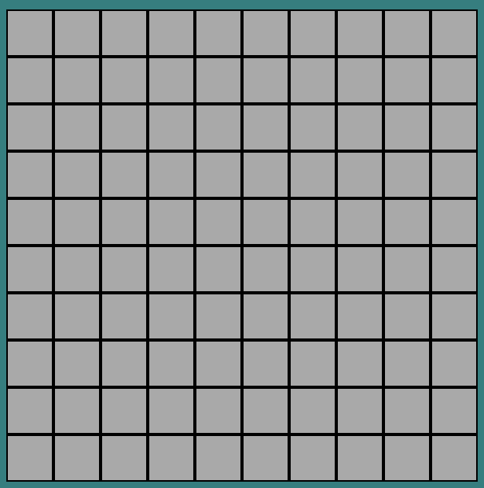
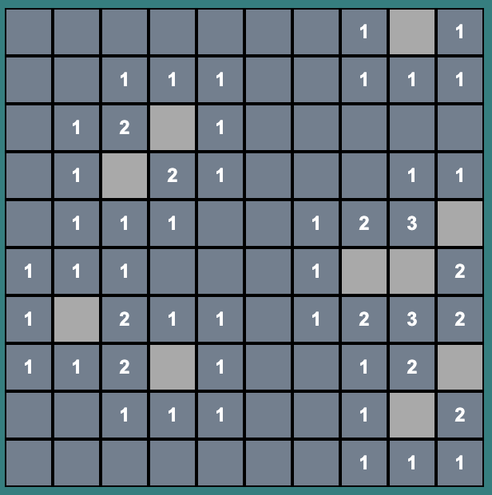
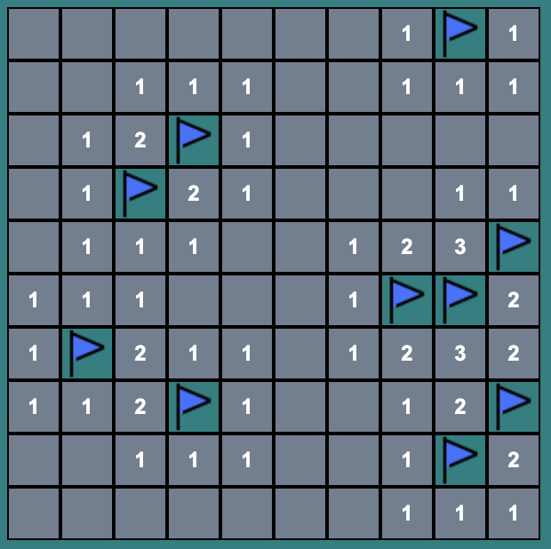

# SEI-26-Project-1

## **Link to game**
You can play the game at https://pages.git.generalassemb.ly/kkusumad/Minesweeper/game/minesweeper.html
  

## **Objective of the project**
General Objective:
1. Create an interactive game using HTML, CSS and Javascript.
2. Use DOM manipulation in Javascript that is triggered by a browser event.

Personal Objective:  
1. Create a variable field onscreen and hide and show elements as needed.
2. Have at least 1 other color theme to toggle between.

----------------------------------------------------------------

## **Game description**
This game requires you to navigate a field riddled with mines sensitive to clicking. How do you clear the grid without triggering any of the mines?  

Don't worry! The people who buried the mines had to get out of the field safely somehow, and left behind their markers denoting how many mines are surrounding a plot and the number of mines they planted.  

Dig up all the plots around the mines, or flag all the mines, help your fellow living folks not blow themselves up!

## **Instructions of the game**
1. **Select your game level:**  
*Tutorial* - Easy mode with one blank space pre-revealed
*Easy* - 10 x 10 field with 10 mines  
*Medium* - 13 x 16 field with 40 mines  
*Hard* - 30 x 16 field with 99 mines  

1. **Controls:**  
*Left click* - reveals the content of the plot. Numbers represent the count of mines adjacent to the plot (corners included). You cannot left click on a plot when it is flagged.  
*Right click* - toggle the flagging/unflagging of the plot where you think the mine is. You cannot left click on this plot while it is flagged.  

3. **Win Conditions:**  
*100% Accurate flagging* - all flags on the field are on the same plot as the mines. If the number of flags are more than the number of mines, the game is not yet over.  
*All non-mine plots revealed* - all plots other than the mines are revealed  with no mines triggered. Flagged plots are not considered revealed.  

4. **Lose Conditions:**  
Any one mine being revealed will lose the game.

----------------------------------------------------------------
## **Technology used**
Javascript, JQuery, HTML, CSS
